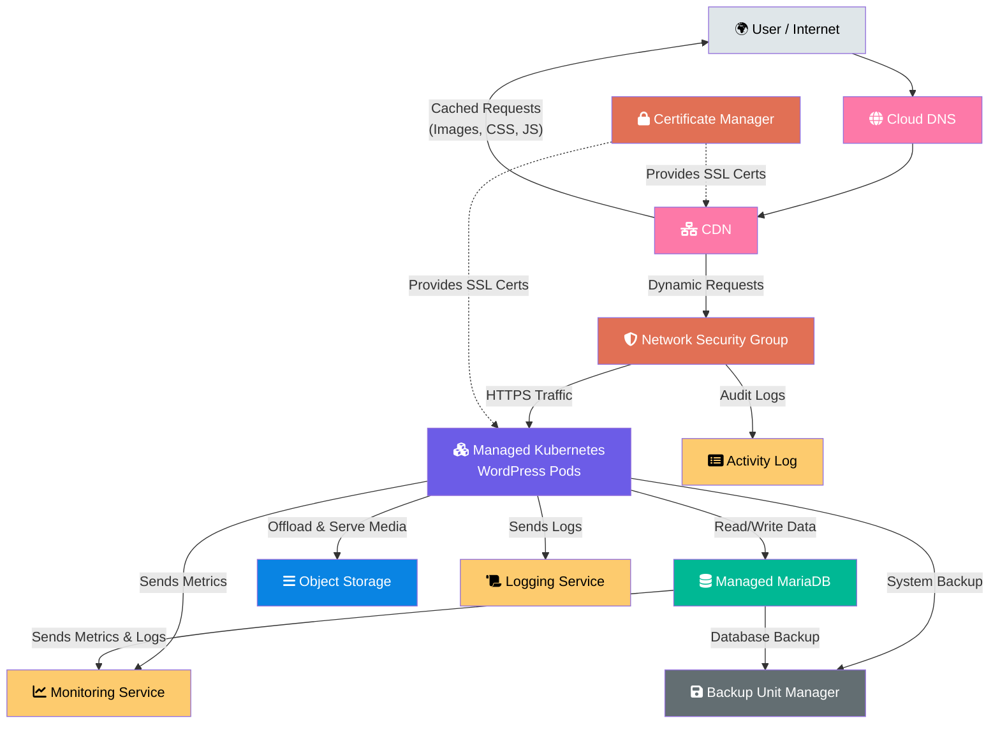

# IONOS Infrastructure Architecture

This repository contains the complete infrastructure setup for a cloud-native WordPress deployment on IONOS Cloud using Kubernetes, with comprehensive monitoring, security, and DevOps practices.

## 🏗️ Architecture Overview

The infrastructure is designed as a multi-layered, highly available system with the following key components:

- **Multi-AZ Kubernetes Cluster** across Frankfurt data centers
- **Managed PostgreSQL and Redis** databases with replication
- **IONOS CDN and Load Balancers** for optimal performance
- **Comprehensive monitoring and logging** with Prometheus and Grafana
- **Automated CI/CD pipeline** with GitLab and Helm
- **Infrastructure as Code** using Terraform and Ansible

## 📊 Architecture Diagram

### High-Level Infrastructure Flow


```mermaid
flowchart TD
    %% Define styles for different categories
    classDef compute fill:#6c5ce7,color:white;
    classDef database fill:#00b894,color:white;
    classDef performance fill:#fd79a8,color:white;
    classDef security fill:#e17055,color:white;
    classDef storage fill:#0984e3,color:white;
    classDef monitoring fill:#fdcb6e,color:black;
    classDef backup fill:#636e72,color:white;
    classDef user fill:#dfe6e9,color:black;

    %% User and Internet
    User[🌍 User / Internet]

    %% Performance Group
    CDN[<i class='fa fa-network-wired'></i> CDN]
    CloudDNS[<i class='fa fa-globe'></i> Cloud DNS]

    %% Security Group
    CertManager[<i class='fa fa-lock'></i> Certificate Manager]
    NetSecGroup[<i class='fa fa-shield-alt'></i> Network Security Group]

    %% Compute Group
    K8s[<i class='fa fa-cubes'></i> Managed Kubernetes<br/>WordPress Pods]

    %% Database Group
    DB[<i class='fa fa-database'></i> Managed MariaDB]

    %% Storage Group
    ObjectStorage[<i class='fa fa-bars'></i> Object Storage]

    %% Monitoring Group
    Monitor[<i class='fa fa-chart-line'></i> Monitoring Service]
    Logger[<i class='fa fa-scroll'></i> Logging Service]
    ActivityLog[<i class='fa fa-list-alt'></i> Activity Log]

    %% Backup Group
    Backup[<i class='fa fa-save'></i> Backup Unit Manager]

    %% Define the traffic flow
    User --> CloudDNS
    CloudDNS --> CDN

    CDN -- Cached Requests<br/>(Images, CSS, JS) --> User
    CDN -- Dynamic Requests --> NetSecGroup

    NetSecGroup -- HTTPS Traffic --> K8s
    K8s -- Read/Write Data --> DB
    K8s -- Offload & Serve Media --> ObjectStorage

    %% Define the management and observability flow
    CertManager -. Provides SSL Certs .-> CDN
    CertManager -. Provides SSL Certs .-> K8s

    K8s -- Sends Metrics --> Monitor
    K8s -- Sends Logs --> Logger
    K8s -- System Backup --> Backup

    DB -- Sends Metrics & Logs --> Monitor
    DB -- Database Backup --> Backup

    NetSecGroup -- Audit Logs --> ActivityLog

    %% Apply styling to the nodes
    class K8s compute;
    class DB database;
    class CDN,CloudDNS performance;
    class CertManager,NetSecGroup security;
    class ObjectStorage storage;
    class Monitor,Logger,ActivityLog monitoring;
    class Backup backup;
    class User user;
```

### Detailed Kubernetes Architecture


```mermaid
graph TB
    %% External Layer
    subgraph "Internet & CDN Layer"
        Internet[Internet Users]
        CDN[IONOS CDN<br/>+ WAF + DDoS Protection]
        DNS[IONOS DNS<br/>Health Checks & Failover]
    end

    %% Security Layer
    subgraph "Security & Certificate Layer"
        CertMgr[IONOS Certificate Manager<br/>Automated SSL/TLS Lifecycle]
        DDoS[IONOS DDoS Protection<br/>Automatic Mitigation]
        NSG[Network Security Groups<br/>Firewall Rules & ACLs]
    end

    %% Load Balancer Layer
    subgraph "Load Balancing Layer"
        ALB[IONOS Application Load Balancer<br/>Layer 7 + SSL Termination]
        NLB[IONOS Network Load Balancer<br/>Layer 4 + Health Checks]
    end

    %% Kubernetes Layer
    subgraph "IONOS Managed Kubernetes Cluster"
        subgraph "Control Plane (FREE)"
            K8sAPI[Kubernetes API Server]
            K8sEtcd[etcd Cluster]
            K8sScheduler[Scheduler]
            K8sController[Controller Manager]
        end
        
        subgraph "Worker Nodes (Multi-AZ)"
            subgraph "AZ-1 (Frankfurt-1)"
                Node1[Worker Node 1<br/>e1-standard-4]
                WP1[WordPress Pod 1]
                WP2[WordPress Pod 2]
            end
            
            subgraph "AZ-2 (Frankfurt-2)"
                Node2[Worker Node 2<br/>e1-standard-4]
                WP3[WordPress Pod 3]
                WP4[WordPress Pod 4]
            end
            
            subgraph "AZ-3 (Frankfurt-3)"
                Node3[Worker Node 3<br/>e1-standard-4]
                WP5[WordPress Pod 5]
                WP6[WordPress Pod 6]
            end
        end
        
        subgraph "Ingress Layer"
            Ingress[NGINX Ingress Controller<br/>SSL Termination & Routing]
        end
        
        subgraph "System Components"
            HPA[Horizontal Pod Autoscaler]
            CA[Cluster Autoscaler]
            CSI[CSI Driver]
        end
    end

    %% Data Layer
    subgraph "Data & Storage Layer"
        subgraph "IONOS Managed PostgreSQL Cluster"
            PGPrimary[PostgreSQL Primary<br/>Node 1 - Frankfurt-1]
            PGReplica1[PostgreSQL Replica<br/>Node 2 - Frankfurt-2]
            PGReplica2[PostgreSQL Replica<br/>Node 3 - Frankfurt-3]
        end
        
        subgraph "IONOS In-Memory DB (Redis)"
            RedisPrimary[Redis Primary<br/>Node 1]
            RedisReplica1[Redis Replica<br/>Node 2]
            RedisReplica2[Redis Replica<br/>Node 3]
        end
        
        subgraph "IONOS Storage Services"
            BlockStorage[Block Storage<br/>High-Performance SSD]
            ObjectStorage[Object Storage<br/>S3-Compatible<br/>Media & Backups]
        end
        
        subgraph "Backup Services"
            BackupService[IONOS Backup Service<br/>Automated + Encrypted]
            DisasterRecovery[Disaster Recovery<br/>Cross-Region Replication]
        end
    end

    %% Monitoring Layer
    subgraph "Monitoring & Observability"
        subgraph "IONOS Monitoring Service"
            Prometheus[Prometheus<br/>Metrics Collection]
            Grafana[Grafana<br/>Dashboards & Visualization]
        end
        
        subgraph "IONOS Logging Service"
            LogAggregation[Log Aggregation<br/>Centralized Logging]
            LogAnalysis[Log Analysis<br/>Search & Alerting]
        end
        
        subgraph "Alerting System"
            AlertManager[Alert Manager<br/>Smart Routing]
            Notifications[Notifications<br/>Email, Slack, PagerDuty]
        end
    end

    %% DevOps Pipeline
    subgraph "DevOps & CI/CD Pipeline"
        subgraph "Infrastructure as Code"
            Terraform[Terraform<br/>IONOS Provider]
            Ansible[Ansible<br/>Configuration Management]
        end
        
        subgraph "CI/CD Pipeline"
            GitHubActions[GitHub Actions<br/>Pipeline Automation]
            Helm[Helm Charts<br/>Application Deployment]
            Registry[IONOS Private Registry<br/>Container Images]
        end
    end

    %% Flow Connections
    Internet --> CDN
    CDN --> DNS
    DNS --> CertMgr
    CertMgr --> DDoS
    DDoS --> NSG
    NSG --> ALB
    ALB --> NLB
    NLB --> Ingress
    
    Ingress --> WP1
    Ingress --> WP2
    Ingress --> WP3
    Ingress --> WP4
    Ingress --> WP5
    Ingress --> WP6
    
    WP1 --> Node1
    WP2 --> Node1
    WP3 --> Node2
    WP4 --> Node2
    WP5 --> Node3
    WP6 --> Node3
    
    Node1 --> K8sAPI
    Node2 --> K8sAPI
    Node3 --> K8sAPI
    
    K8sAPI --> K8sEtcd
    K8sAPI --> K8sScheduler
    K8sAPI --> K8sController
    
    HPA --> K8sAPI
    CA --> K8sAPI
    CSI --> BlockStorage
    
    WP1 -.-> PGPrimary
    WP2 -.-> PGPrimary
    WP3 -.-> PGPrimary
    WP4 -.-> PGPrimary
    WP5 -.-> PGPrimary
    WP6 -.-> PGPrimary
    
    PGPrimary --> PGReplica1
    PGPrimary --> PGReplica2
    
    WP1 -.-> RedisPrimary
    WP2 -.-> RedisPrimary
    WP3 -.-> RedisPrimary
    WP4 -.-> RedisPrimary
    WP5 -.-> RedisPrimary
    WP6 -.-> RedisPrimary
    
    RedisPrimary --> RedisReplica1
    RedisPrimary --> RedisReplica2
    
    Node1 --> BlockStorage
    Node2 --> BlockStorage
    Node3 --> BlockStorage
    
    ObjectStorage --> BackupService
    PGPrimary --> BackupService
    BackupService --> DisasterRecovery
    
    %% Monitoring Connections
    Node1 -.-> Prometheus
    Node2 -.-> Prometheus
    Node3 -.-> Prometheus
    WP1 -.-> Prometheus
    WP2 -.-> Prometheus
    WP3 -.-> Prometheus
    WP4 -.-> Prometheus
    WP5 -.-> Prometheus
    WP6 -.-> Prometheus
    PGPrimary -.-> Prometheus
    RedisPrimary -.-> Prometheus
    
    Prometheus --> Grafana
    LogAggregation --> LogAnalysis
    Prometheus --> AlertManager
    AlertManager --> Notifications
    
    %% DevOps Connections
    Terraform -.-> K8sAPI
    Ansible -.-> Node1
    Ansible -.-> Node2
    Ansible -.-> Node3
    GitHubActions --> Registry
    Helm --> K8sAPI
    Registry --> Node1
    Registry --> Node2
    Registry --> Node3
```

## Kubernetes infrastructure overview

flowchart TD
    %% Define styles for different categories
    classDef compute fill:#6c5ce7,color:white;
    classDef database fill:#00b894,color:white;
    classDef performance fill:#fd79a8,color:white;
    classDef security fill:#e17055,color:white;
    classDef storage fill:#0984e3,color:white;
    classDef monitoring fill:#fdcb6e,color:black;
    classDef backup fill:#636e72,color:white;
    classDef user fill:#dfe6e9,color:black;

    %% User and Internet
    User[🌍 User / Internet]

    %% Performance Group
    CDN[<i class='fa fa-network-wired'></i> CDN]
    CloudDNS[<i class='fa fa-globe'></i> Cloud DNS]

    %% Security Group
    CertManager[<i class='fa fa-lock'></i> Certificate Manager]
    NetSecGroup[<i class='fa fa-shield-alt'></i> Network Security Group]

    %% Compute Group
    K8s[<i class='fa fa-cubes'></i> Managed Kubernetes<br/>WordPress Pods]

    %% Database Group
    DB[<i class='fa fa-database'></i> Managed MariaDB]

    %% Storage Group
    ObjectStorage[<i class='fa fa-bars'></i> Object Storage]

    %% Monitoring Group
    Monitor[<i class='fa fa-chart-line'></i> Monitoring Service]
    Logger[<i class='fa fa-scroll'></i> Logging Service]
    ActivityLog[<i class='fa fa-list-alt'></i> Activity Log]

    %% Backup Group
    Backup[<i class='fa fa-save'></i> Backup Unit Manager]

    %% Define the traffic flow
    User --> CloudDNS
    CloudDNS --> CDN

    CDN -- Cached Requests<br/>(Images, CSS, JS) --> User
    CDN -- Dynamic Requests --> NetSecGroup

    NetSecGroup -- HTTPS Traffic --> K8s
    K8s -- Read/Write Data --> DB
    K8s -- Offload & Serve Media --> ObjectStorage

    %% Define the management and observability flow
    CertManager -. Provides SSL Certs .-> CDN
    CertManager -. Provides SSL Certs .-> K8s

    K8s -- Sends Metrics --> Monitor
    K8s -- Sends Logs --> Logger
    K8s -- System Backup --> Backup

    DB -- Sends Metrics & Logs --> Monitor
    DB -- Database Backup --> Backup

    NetSecGroup -- Audit Logs --> ActivityLog

    %% Apply styling to the nodes
    class K8s compute;
    class DB database;
    class CDN,CloudDNS performance;
    class CertManager,NetSecGroup security;
    class ObjectStorage storage;
    class Monitor,Logger,ActivityLog monitoring;
    class Backup backup;
    class User user;

## 🏛️ Infrastructure Components

### 🌐 Internet & CDN Layer
- **IONOS CDN**: Global content delivery with WAF and DDoS protection
- **IONOS DNS**: Health checks and automatic failover
- **Internet Users**: External traffic routing

### 🛡️ Security & Certificate Layer
- **IONOS Certificate Manager**: Automated SSL/TLS certificate lifecycle management
- **IONOS DDoS Protection**: Automatic mitigation of distributed attacks
- **Network Security Groups**: Firewall rules and access control lists

### ⚖️ Load Balancing Layer
- **IONOS Application Load Balancer**: Layer 7 load balancing with SSL termination
- **IONOS Network Load Balancer**: Layer 4 load balancing with health checks

### ☸️ Kubernetes Cluster
- **Control Plane**: Free managed Kubernetes control plane
- **Worker Nodes**: Multi-AZ deployment across Frankfurt data centers
- **WordPress Pods**: 6 pods distributed across 3 availability zones
- **System Components**: HPA, Cluster Autoscaler, and CSI driver

### 🗄️ Data & Storage Layer
- **PostgreSQL Cluster**: Primary and replica nodes across AZs
- **Redis Cluster**: Primary and replica nodes for caching
- **Storage Services**: Block storage and S3-compatible object storage
- **Backup Services**: Automated encrypted backups with disaster recovery

### 📊 Monitoring & Observability
- **Prometheus**: Metrics collection and storage
- **Grafana**: Dashboards and visualization
- **Logging**: Centralized log aggregation and analysis
- **Alerting**: Smart routing with multiple notification channels

### 🚀 DevOps & CI/CD Pipeline
- **Terraform**: Infrastructure as Code with IONOS provider
- **Ansible**: Configuration management
- **GitLab CI/CD**: Pipeline automation
- **Helm**: Application deployment charts
- **Private Registry**: Container image storage

## 🚀 Quick Start

1. **Clone the repository**:
   ```bash
   git clone <repository-url>
   cd ionos
   ```

2. **Initialize Terraform**:
   ```bash
   cd infrastructure
   terraform init
   terraform plan
   terraform apply
   ```

3. **Deploy Kubernetes applications**:
   ```bash
   cd ../kubernetes
   kubectl apply -k overlays/dev/
   ```

## 📁 Project Structure

```
ionos/
├── infrastructure/          # Terraform infrastructure code
├── kubernetes/             # Kubernetes manifests and Kustomize
│   ├── applications/       # Application deployments
│   └── infrastructure/     # Infrastructure components
└── README.md              # This file
```

## 🔧 Configuration

The infrastructure can be customized through:
- `infrastructure/terraform.tfvars` - Terraform variables
- `kubernetes/overlays/` - Environment-specific configurations
- `kubernetes/applications/` - Application-specific settings

## 📈 Monitoring & Alerts

The monitoring stack provides:
- Real-time metrics collection
- Custom dashboards for WordPress performance
- Automated alerting for critical issues
- Log aggregation and analysis

## 🔒 Security Features

- Automated SSL/TLS certificate management
- DDoS protection and mitigation
- Network security groups and firewall rules
- Encrypted backups and storage
- Multi-AZ redundancy for high availability

## 🤝 Contributing

1. Fork the repository
2. Create a feature branch
3. Make your changes
4. Test thoroughly
5. Submit a pull request

## 📄 License

This project is licensed under the MIT License - see the LICENSE file for details.

## 🆘 Support

For issues and questions:
- Create an issue in this repository
- Check the IONOS documentation
- Review the troubleshooting guide

---

**Note**: This architecture is designed for production use with IONOS Cloud services. Ensure you have the necessary IONOS account and permissions before deployment.