# ionos
# IONOS Infrastructure Architecture

This repository contains the complete infrastructure setup for a cloud-native WordPress deployment on IONOS Cloud using Kubernetes, with comprehensive monitoring, security, and DevOps practices.

## Architecture Overview

The infrastructure is designed as a multi-layered, highly available system with the following key components:

- **Kubernetes Cluster** across Frankfurt data centers
- **Managed MariaDB and Redis** databases with replication
- **IONOS CDN and Load Balancers** for optimal performance
- **Comprehensive monitoring and logging** with Prometheus and Grafana
- **Automated CI/CD pipeline** with Github actions and Helm
- **Infrastructure as Code** using Terraform
- **GitOps** with FluxCD

## Architecture Diagram

### High-Level Infrastructure Flow

```mermaid
flowchart TD
    %% Define styles for different categories
    classDef compute fill:#6c5ce7,color:white;
    classDef database fill:#00b894,color:white;
    classDef performance fill:#fd79a8,color:white;
    classDef security fill:#e17055,color:white;
    classDef storage fill:#0984e3,color:white;
    classDef monitoring fill:#fdcb6e,color:black;
    classDef backup fill:#636e72,color:white;
    classDef user fill:#dfe6e9,color:black;

    %% User and Internet
    User[🌍 User / Internet]

    %% Performance Group
    CDN[<i class='fa fa-network-wired'></i> CDN]
    CloudDNS[<i class='fa fa-globe'></i> Cloud DNS]

    %% Security Group
    CertManager[<i class='fa fa-lock'></i> Certificate Manager]
    NetSecGroup[<i class='fa fa-shield-alt'></i> Network Security Group]

    %% Compute Group
    K8s[<i class='fa fa-cubes'></i> Managed Kubernetes<br/>WordPress Pods]

    %% Database Group
    DB[<i class='fa fa-database'></i> Managed MariaDB]

    %% Storage Group
    ObjectStorage[<i class='fa fa-bars'></i> Object Storage]

    %% Monitoring Group
    Monitor[<i class='fa fa-chart-line'></i> Monitoring Service]
    Logger[<i class='fa fa-scroll'></i> Logging Service]
    ActivityLog[<i class='fa fa-list-alt'></i> Activity Log]

    %% Backup Group
    Backup[<i class='fa fa-save'></i> Backup Unit Manager]

    %% Define the traffic flow
    User --> CloudDNS
    CloudDNS --> CDN

    CDN -- Cached Requests<br/>(Images, CSS, JS) --> User
    CDN -- Dynamic Requests --> NetSecGroup

    NetSecGroup -- HTTPS Traffic --> K8s
    K8s -- Read/Write Data --> DB
    K8s -- Offload & Serve Media --> ObjectStorage

    %% Define the management and observability flow
    CertManager -. Provides SSL Certs .-> CDN
    CertManager -. Provides SSL Certs .-> K8s

    K8s -- Sends Metrics --> Monitor
    K8s -- Sends Logs --> Logger
    K8s -- System Backup --> Backup

    DB -- Sends Metrics & Logs --> Monitor
    DB -- Database Backup --> Backup

    NetSecGroup -- Audit Logs --> ActivityLog

    %% Apply styling to the nodes
    class K8s compute;
    class DB database;
    class CDN,CloudDNS performance;
    class CertManager,NetSecGroup security;
    class ObjectStorage storage;
    class Monitor,Logger,ActivityLog monitoring;
    class Backup backup;
    class User user;
```



A User's request is first resolved by Cloud DNS to find the correct IP address.

The request hits the CDN first. If the resource is cached (like an image), it's served directly back to the user.

For dynamic page requests (like a WordPress post), the request passes through the Network Security Group (firewall), which only allows HTTPS traffic.

The request reaches the Managed Kubernetes cluster running the WordPress pods.

WordPress in Kubernetes connects to the Managed MariaDB to fetch data and uses Object Storage for any media files.

Management & Observability Flow (Dotted Lines):

The Certificate Manager provides SSL certificates to both the CDN and the Kubernetes pods to enable HTTPS encryption.

The Kubernetes application and the MariaDB database continuously send metrics and logs to the Monitoring and Logging services.

Both systems are backed up to the Backup Unit Manager.

Administrative actions and firewall events are recorded in the Activity Log.

### Detailed Kubernetes Architecture


## Infrastructure Components

### Internet & CDN Layer

- **IONOS CDN**: Global content delivery with WAF and DDoS protection
- **IONOS DNS**: Health checks and automatic failover
- **Internet Users**: External traffic routing

### Security & Certificate Layer

- **IONOS Certificate Manager**: Automated SSL/TLS certificate lifecycle management
- **IONOS DDoS Protection**: Automatic mitigation of distributed attacks
- **Network Security Groups**: Firewall rules and access control lists

### Load Balancing Layer

- **IONOS Application Load Balancer**: Layer 7 load balancing with SSL termination
- **IONOS Network Load Balancer**: Layer 4 load balancing with health checks

### Kubernetes Cluster

- **Control Plane**: Free managed Kubernetes control plane
- **Worker Nodes**: Multi-AZ deployment across Frankfurt data centers
- **WordPress Pods**: 6 pods distributed across 3 availability zones
- **System Components**: HPA, Cluster Autoscaler, and CSI driver

### 🗄️ Data & Storage Layer

- **MariaDB Cluster**: Primary and replica nodes across AZs
- **Redis Cluster**: Primary and replica nodes for caching
- **Storage Services**: Block storage and S3-compatible object storage
- **Backup Services**: Automated encrypted backups with disaster recovery

### Monitoring & Observability

- **Prometheus**: Metrics collection and storage
- **Grafana**: Dashboards and visualization
- **Logging**: Centralized log aggregation and analysis
- **Alerting**: Smart routing with multiple notification channels

#### Observability Infrastructure Overview


### DevOps & CI/CD Pipeline

- **Terraform**: Infrastructure as Code with IONOS provider
- **Gihub Actions**: Pipeline automation
- **Helm**: Application deployment charts

## Quick Start

1. **Clone the repository**:

   ```bash
   git clone <repository-url>
   cd ionos
   ```
2. **Initialize Terraform**:

   ```bash
   cd infrastructure
   terraform init
   terraform plan
   terraform apply
   ```
3. **Deploy Kubernetes applications**:

   ```bash
   cd ../kubernetes
   kubectl apply -k overlays/dev/
   ```

## 📁 Project Structure

```
ionos/
├── infrastructure/          # Terraform infrastructure code
├── kubernetes/             # Kubernetes manifests and Kustomize
│   ├── applications/       # Application deployments
│   └── infrastructure/     # Infrastructure components
└── README.md              # This file
```

## Configuration

The infrastructure can be customized through:

- `infrastructure/terraform.tfvars` - Terraform variables
- `kubernetes/overlays/` - Environment-specific configurations
- `kubernetes/applications/` - Application-specific settings

## Monitoring & Alerts

The monitoring stack provides:

- Real-time metrics collection
- Custom dashboards for WordPress performance
- Automated alerting for critical issues
- Log aggregation and analysis

## Security Features

- Automated SSL/TLS certificate management
- DDoS protection and mitigation
- Network security groups and firewall rules
- Encrypted backups and storage
- Multi-AZ redundancy for high availability